# Xkeystroke

>Xkeystroke is a modular intelligence orchestration platform with a local web panel that unifies entity targeting, identity simulation, geospatial and network visualization, and temporal and log correlation into a cohesive multi panel system for managing, mapping, and analyzing complex interconnected data and behavior at scale.


## Architecture

```mermaid
flowchart TD

    %% Control Plane
    A[Xkeystroke Control Plane]

    %% Main Panels
    A --> T[Target]
    A --> S[SockPuppet]
    A --> WM[World Map]
    A --> NM[Network Map]
    A --> CM[Connections Map]
    A --> TL[Timeline]
    A --> LG[Logs]
    A --> ST[Storage]
    A --> MN[Markdown Notes]
    A --> SR[Search]

    %% Target Tools
    T --> T1[Categorization]
    T --> T2[Attribute Mgmt]
    T --> T3[Linking]
    T --> T4[Correlation / Relationships]
    T --> T5[Risk / Activity]

    %% SockPuppet Tools
    S --> S1[Identity Generation]
    S --> S2[Persona Management]
    S --> S3[Behavior Simulation]
    S --> S4[Session / Browser Isolation]
    S --> S5[Proxy Assignment / Consistency]
    S --> S6[Account Lifecycle Mgmt]
    S --> S7[Detection Avoidance]

    %% Mapping Systems
    WM --> WM1[Geospatial Analysis]
    NM --> NM1[Topology Modeling]
    CM --> CM1[Relationship Graphing]
    CM1 --> CM2[Centrality / Clustering]

    %% Timeline + Logs
    TL --> TL1[Temporal Correlation]
    TL --> TL2[Pattern Detection]
    LG --> LG1[Event Tracking]
    LG --> LG2[Error / Context Linking]

    %% Storage + Notes
    ST --> ST1[Encryption / Versioning]
    ST --> ST2[Media / Data Handling]
    MN --> MN1[Backlinks / Contextual Notes]

    %% Search Environment Control
    SR --> SR1[Fingerprint / User-Agent Control]
    SR --> SR2[Session / Cookie Handling]
    SR --> SR3[Traffic / Header Control]
    SR --> SR4[Emulation / Isolation]

    %% Data Fusion Layer
    T5 --> TL1
    WM1 --> CM1
    NM1 --> CM1
    LG1 --> TL1
    CM2 --> T4

    %% Execution Boundary
    A --> V[Ephemeral Kali Linux VM Sandbox]

    %% VM Internal
    V --> V1[Isolated Execution Environment]
    V --> V2[Session Compartmentalization]
    V --> V3[Tool-driven Task Execution]

    %% Network Obfuscation
    V --> N[Network Obfuscation Layer]
    N --> N1[Tor]
    N --> N2[ProxyChains]
    N --> N3[Traffic Obfuscation]

    %% External
    N --> Z[Internet]

    %% Return Flow
    Z --> N
    N --> V
    V --> A
```



## Requirements

- **Node.js**: use a modern Node version (this project sets `NODE_OPTIONS=--openssl-legacy-provider` for CRA compatibility)
- **npm**

## Install

From the repo root:

```bash
cd /home/iced/xkeystroke

# 1) Install frontend dependencies
npm install

# 2) Install backend dependencies
cd server
npm install
cd ..
```

## Run

Start both frontend and backend:

```bash
npm start
```

After it starts:

- Open `http://localhost:3000`
- The legal disclaimer dialog will appear until you click `Continue`


## Routes (Pages)

- `GET /login` -> Login page
- `POST /login` -> backend login API (proxied by CRA)
- `GET /signup` -> Sign Up page
- `POST /signup` -> backend signup API (proxied by CRA)
- `GET /` -> Dashboard (protected)
- `GET /dashboard` -> Dashboard (protected)
- `GET /scanner` -> File Scanner (protected)
- `GET /profile` -> Profile (protected)
- `GET /users` -> Users management (admin protected)
- `*` -> Not found page

## Left Sidebar Tools (Dashboard)

The Dashboard page (`/` / `/dashboard`) includes a left sidebar with:
- A top panel selector: one of the “main panels” below
- A context-specific “bottom tools” list that changes based on which main panel you select

| Main Panel        | Tools |
|------------------|-------|
| Target           | Categorization, Attribute Mgmt, Linking, Data Aggregation, Correlation, Relationships, Activity, Risk / Priority, Notes |
| SockPuppet       | Identity Profile Creation, Persona Management, Alias Generation, Username Generation, Email Generation / Management, Account Creation Automation, Account Warm-up / Aging, Activity Seeding, Content Seeding, Behavior Simulation (Human-like activity), Interaction Simulation (likes, follows, posts), Engagement Pattern Control, Browser Profile Isolation, Session Isolation, Cookie / Session Persistence, Proxy Assignment per Identity, IP Consistency Management, Geo-Location Consistency, Device / Fingerprint Assignment, Fingerprint Consistency Management, Account Compartmentalization, Identity Separation Enforcement, Credential Management, Multi-account Management, Recovery / Backup Management, Burn / Disposal (identity teardown), Risk Scoring / Detection Avoidance, Usage Pattern Randomization |
| World Map        | Edit Layers, Layer Filtering, Entity Plotting, Clustering / Heatmaps, Geocoding / Reverse, Route / Movement, Time-based Mapping, Area / Radius Analysis, Distance / Proximity, Spatial Correlation, Data Enrichment |
| Network Map      | Topology Visualization, Node Mapping, Connection Mapping, Hierarchy Mapping, Network Segmentation, Dynamic Updates, Snapshotting, Multi-network Overlay, Logical vs Physical Mapping, Topology Filtering, Sub-topology Isolation, Dependency Mapping, Redundancy Mapping, Topology Correlation |
| Connections Map  | Entity Mapping, Relationship Mapping, Connection Visualization, Relationship Classification, Direction Mapping, Multi-entity Linking, Cross-source Correlation, Connection Discovery, Indirect Link Detection, Cluster Detection, Group Identification, Influence / Centrality Mapping, Key Entity Identification, Connection Filtering, Subgraph Isolation, Relationship Enrichment |
| Markdown Notes   | Backlink Tracking, Contextual Linking, Templates, Snapshot Embedding |
| Storage          | Tagging / Labeling, Duplicate Detection, Version Tracking, Virus Scanner, Format Conversion, Encryption / Decryption, Thumbnail Generation, Access Protection, Media Viewer, Editors |
| Logs             | Status, Sources, Process Tracking, Instance Logs, Severity Levels, Event Categorization, Log Persistence, Correlation, Context Linking, Error Tracking |
| Timeline         | Timestamp Normalization, Time Correlation, Event Sequencing Logic, Temporal Clustering, Pattern Detection (Time-based), Cross-Platform Activity Correlation, Alias Usage Over Time, Behavioral Pattern Analysis, Domain Registration Correlation, DNS Change Correlation, Infrastructure Change Tracking, Breach Timeline Correlation, Credential Exposure Correlation, Metadata Time Extraction, Media Timestamp Correlation, Geolocation Timeline Correlation, Movement Pattern Analysis, Anomaly Detection (time-based), Gap Analysis (missing time periods), Time-based Filtering Engine, Time Range Comparison Logic, Multi-entity Timeline Correlation |
| Search           | Browser Fingerprint, Behavior Simulation, User-Agent, Cookies/Session, Cache, Proxy/Routing, Request Header, Traffic, Isolation, Emulation, Timezone, Referer, Language, DNT, LocalStorage, Logs, Manager |


## User Management (Admin)

The admin-only users page is available at:
- `GET /users`

It is protected by `ProtectedAdminRoute` (requires authentication and `userRole === 'admin'`).

## License

MIT. See `LICENSE`.
